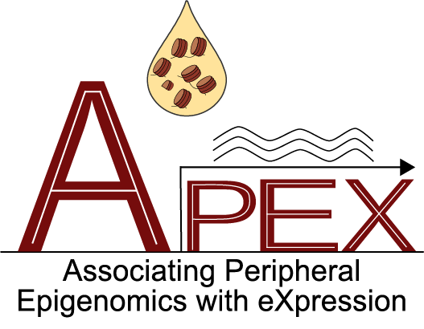

  <!-- 🎨 YOUR LOGO GOES HERE -->
  

<h1 align="center">APEX – Version 2.3.3 Released </h1>

  
  =4.4.0-blue?style=flat-square&logo=r">
  
  /<YOUR_REPO>?style=flat-square">
  <!-- .svg"> -->
  

---
